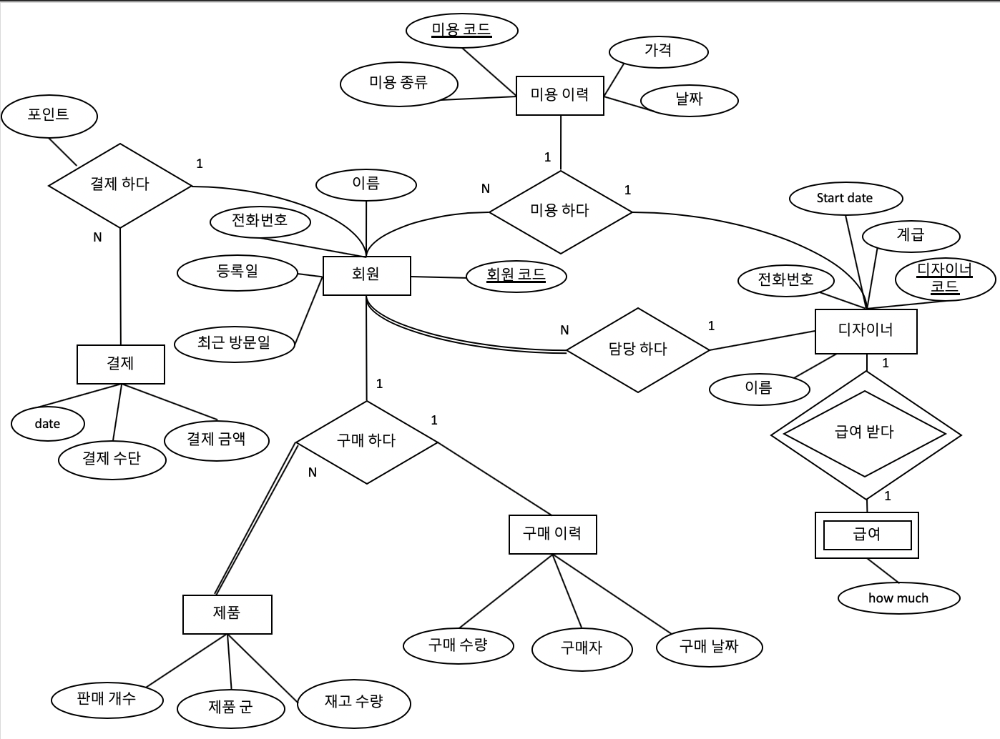

## 2019-03 Database Systems Project

## Subject

헤어샵 

## Requirements

1. 회원
* 헤어 컷을 하기 위해 회원 등록을 할 수 있다.
* 각 회원은 회원 코드로 식별 되어야 하며, 이는 유일해야한다.
* 각 회원은 이름, 전화번호, 담당 디자이너, 등록일, 최근 방문 일을 가진다.
* 각 회원은 적립 포인트를 가지며, 이를 이용해 결제할 수 있다.
* 각 회원은 적립 포인트를 충전할 수 있다.
* 회원은 회원 정보를 변경할 수 있다.
* 회원 별로 구매한 제품 이력을 확인할 수 있다.

2. 헤어 디자이너
* 헤어 디자이너를 등록할 수 있다.
* 각 헤어 디자이너는 코드로 식별 되어야 하며, 이는 유일해야한다.
* 각 헤어 디자이너는 이름, 전화번호, 최초 근무일, 계급을 가진다.
* 헤어 디자이너의 계급은 점장, 매니저, 직원으로 나뉜다.
* 헤어 디자이너는 계급별로 다른 급여를 받는다.
* 각 헤어 디자이너는 담당 회원 목록을 가진다.

3. 제품

* 미용실에서는 여러 제품을 판매할 수 있다.

* 판매 제품 군은 샴푸, 린스, 영양 크림이다.

* 제품 군 별로 남아있는 재고 수를 확인할 수 있다.

* 각 제품 군 마다 다른 가격을 가질 수 있다.

* 각 제품 별로 판매 개수를 확인할 수 있다.

4. 예약
* 회원은 헤어 미용을 사전에 예약할 수 있다.
* 예약 시 예약 날짜와 시간을 지정할 수 있다.
* 예약 시 미용 종류를 선택할 수 있다.
* 미용 종류에는 컷트, 매직, 파마가 있다.
* 전체 예약 목록을 확인할 수 있다.

5. 미용 기록
* 지난 헤어 미용 기록을 확인할 수 있다.
* 각 기록은 미용 코드로 식별 되어야 하며, 이는 유일해야한다.
* 각 기록은 회원, 디자이너, 날짜, 요금을 가진다.

6. 결제

* 각 회원은 적립 포인트를 가지며, 이를 이용해 결제할 수 있다.
* 각 회원은 적립 포인트를 충전할 수 있다.
* 미용 종류에 따라 가격이 다르다.

## ER Diagram

